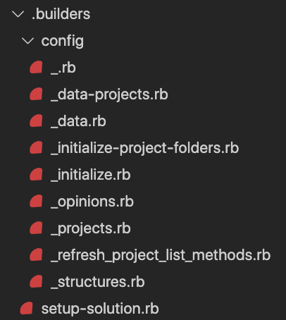
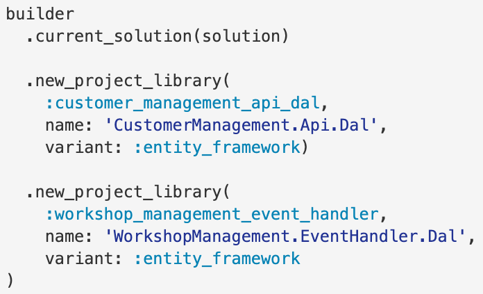
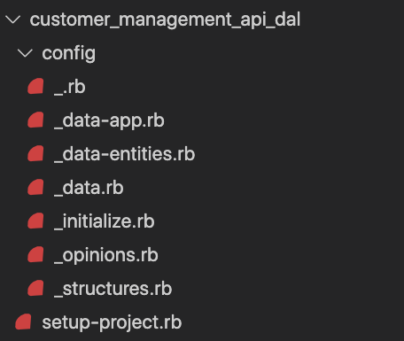
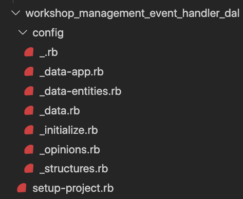

# K Builder Dotnet

> K Builder Dotnet provides various fluent builders for building dotnet assets, specifically for c#

As a C# Developer, I want to generate dotnet code, projects and solutions quickly, so I build repeating patterns quickly

## Usage

### Sample Classes

#### Create solution

Create a new solution that contains many projects to solve a business problem.

```ruby
solution = builder.new_solution(:pitstop)
```



#### Create project(s)

Create two projects attached to the solution



<table>
<tr>
<td>



</td>
<td>



</td>
</tr>
</table>
